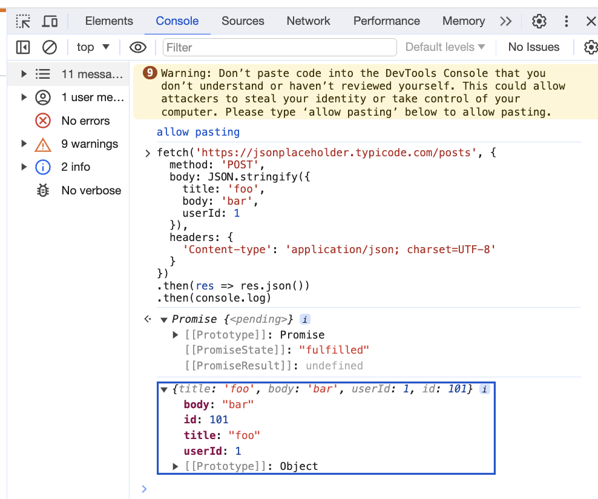

# Workshop tasks

## Task 1

### Fix the calculator

As a Special Product Engineer at Wise, your mission is to enhance the target amount calculation for Wise transfers. The target amount represents the final amount that the recipient receives after accounting for all fees and charges applied to the transfer.

- Run all tests, see which tests fail
- Run frontend tests for calculator at "frontend/calculator"
- Run backend tests for calculator at "api/calculator"
- Fix the relevant code - Find the TODO
- Run the tests to ensure they are running correctly
- Open up the frontend page for the calculator. Is it working correctly?

### Tips

Go to localhost:3000/calculator. Why is it not working? 

- What can you use in the Google Chrome developer tools to figure out what is wrong? Click on the Network tab.
- Is there any error trace or logging on the backend server?

The API for calculator expects a POST request. Is this a RESTful practice? Does this follow REST principles?

Reading materials for REST APIs:

- [What is a REST API? Video](https://www.youtube.com/watch?v=lsMQRaeKNDk&t=10s)
- [Is it ok to POST without creating resource](https://stackoverflow.com/questions/21473437/restful-when-is-it-ok-to-post-without-creating-a-resource-on-server)
- [REST API design best practices](https://stackoverflow.blog/2020/03/02/best-practices-for-rest-api-design/)


How do we make a POST request to the backend server?

We could use a program like Postman or command line cURL, but let's try Google Chrome developer tools.

Did you know you can run javascript on Console?



To make a post request to our calculator API:

```javascript
fetch('http://localhost:3000/api/calculator', {
  method: 'POST',
  body: JSON.stringify({
    sourceAmount: 100,
    sourceCurrency: "SGD", 
    targetCurrency: "USD"
  }),
  headers: {
    'Content-type': 'application/json; charset=UTF-8'
  }
})
.then(res => res.json())
.then(console.log)
```

Does the API work as expected?

## Task 2

### Fix the transfer details page

For transfers that are already created, retrieve the pricing used from the pricing table. Fix our transfers API!

Go to localhost:3000/transfers/1

Same thing, can you figure out why is it not working?

- Run all backend tests
- Run only the "api/transfers" tests

Now go to localhost:3000/api/transfers/1. What do you see? 

After fixing the API, there is still something missing from the frontend. The fee is missing! Can you figure out how to fix it?

- Run all frontend tests
- Run only the "frontend/transfers" tests


### Tips

- The backend queries the database, but it does not use pure SQL queries. Consider finding an example of `knex` either in this project or online documentation.

- You will need to query more than 1 database table for this task.


When you go to localhost:3000/api/transfers/1, is this a GET request?

Also try localhost:3000/api/transfers/2 and localhost:3000/api/transfers/30. 

- Anything different? What do the numbers 1, 2 and 30 mean?

- What is the difference between going to localhost:3000/transfers/1 vs localhost:3000/api/transfers/1 on your browser?

## Task 3

### Analytics

Now the fun part begins! Let's analyze some data.

#### Transaction Analysis

1. Analyze the dataset to identify the most common currency pairs exchanged.

2. Calculate the average transaction amount for each currency pair.


#### Fee Analysis

1. Evaluate the total transaction fees across different currency pairs.

2. Calculate the average transaction fee as a percentage of the transaction amount for each currency pair.

Use DBBeaver for this task.

> Right click on your DB connection > SQL Editor > Open SQL script